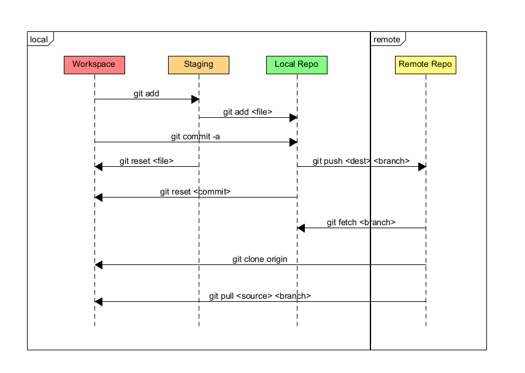

# Version Control Basics

## 1. Version Control Systems

Version control systems (VCS) track changes to files (usually code) over time. Three types of version control.

1. **Local Version Control Systems**  
  - Store changes ONLY on a user’s local machine.
  - If the local machine fails, the history may be lost.

2. **Centralized Version Control Systems (CVCS)**
  - A single central server maintains all versioned files.
  - Clients check out and commit to this server.

3. **Distributed Version Control Systems (DVCS)**  
   - Every user has a complete copy of the repository, including history.

**What Type Is Git?**  
Git is a **Distributed Version Control System (DVCS)**, providing each user a full clone of the repository with complete history.

---

## 2. Snapshots

A **snapshot** is the complete state of the files at a specific time. Git stores a snapshot of the staged changes in a commit, rather than storing differences (deltas) between file versions. Unchanged files are linked by reference.

---

## 3. What Is a Repository?

A **repository** (or **repo**) is a database storing all snapshots and metadata for a project’s history. Since it has the complete history, it also contains all current files. Locally, the `.git/` directory on a developer’s machine contains all commits, branches, and tags for local operations. Remotely, the repo can be hosted on GitHub, GitLab, Bitbucket, or similar server.

---

## 4. What Is a Commit?

A **commit** is a recorded snapshot in the repository’s history. Each commit has a unique hash ID, author, timestamp, and message describing changes. Commits form a linked chain (DAG) representing the project’s evolution.

---

## 5. What Is the Working Directory?

The **working directory** is the set of files contained in the root of a git project. The root is the first location in which there is a `.git` subdirectory. In that subdirectory, all changes to the git project are tracked.

---

## 6. What Is the Staging Area?

The **staging area** holds changes that will go into the next commit. The command `git add <file>` moves modifications from the working directory into the staging area. This enables users to select changes they want in a commit so that related changes can be grouped together.

---

## 7. Architecture and Flow

